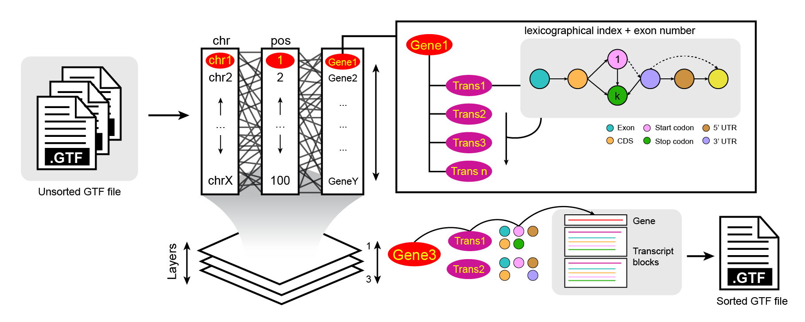
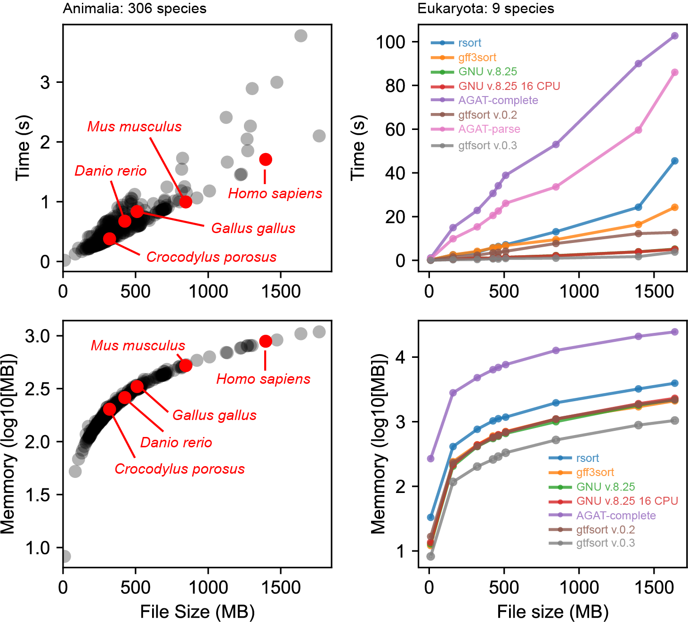
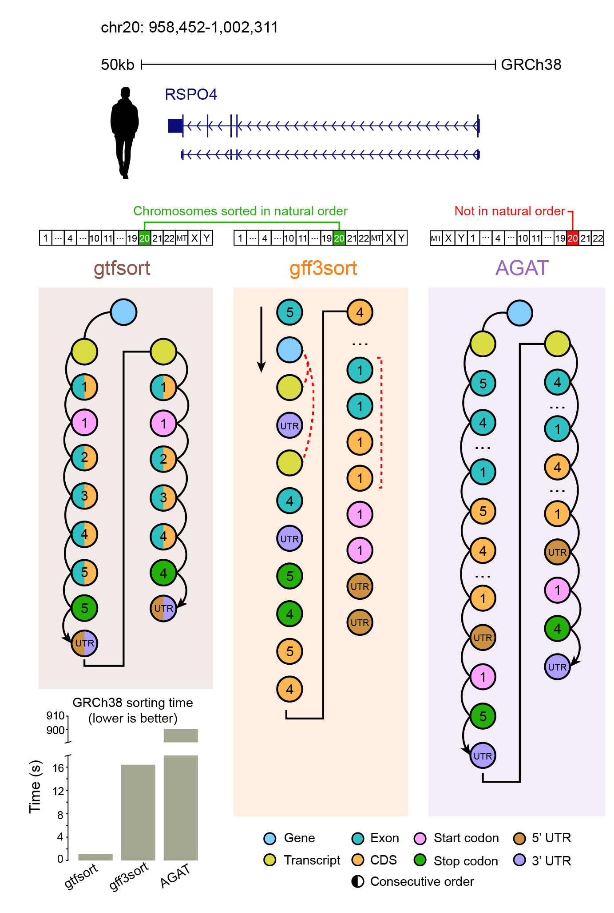

<p align="center">
  <h1 align="center">
    gtfsort
  </h1>

  <p align="center">
    <a href="https://img.shields.io/badge/version-0.1.0dev-green" target="_blank">
      
    </a>
    <a href="https://crates.io/crates/chaintools" target="_blank">
      
    </a>
    <a href="https://github.com/alejandrogzi/chaintools" target="_blank">
      
    </a>
    <a href="https://crates.io/crates/chaintools" target="_blank">
      
    </a>
  </p>


  <p align="center">
    An optimized chr/pos/feature GTF/GFF sorter using a lexicographically-based index ordering algorithm written in Rust.
  </p>

</p>


<p align="center">
    
</p>

While current tools (most of them GFF3-focused) have been recommended for sorting GTF files, none are directed towards chr/pos/feature ordering. This approach ensures custom sorting directionality, which is useful for reducing computation times in tools that work with sorted GTF files. Furthermore, it provides a friendly and organized visualization of gene structures (gene -> transcript -> CDS/exon -> start/stop -> UTR/Sel), allowing users to search for features more efficiently.

>[!NOTE]
> 
> If you use gtfsort in your work, please cite:
> 
> Gonzales-Irribarren A and Fu. A. gtfsort: a tool to efficiently sort GTF files. bioRxiv 2023.10.21.563454; doi: https://doi.org/10.1101/2023.10.21.563454

## Usage
### Binary
``` rust
Usage: gtfsort -i <GTF> -o <OUTPUT> [-t <THREADS>]

Arguments:
    -i, --input <GTF>: unsorted GTF file
    -o, --output <OUTPUT>: sorted GTF file

Options:
    -t, --threads <THREADS>: number of threads [default: your max ncpus]
    --help: print help
    --version: print version
```

### Library
``` rust
use gtfsort::sort_annotations;
use num_cpus;

fn main() {
    let input = PathBuf::new("/path/to/unsorted.gtf");
    let output = PathBuf::new("/path/to/sorted.gtf");

    let gtfsort_job_info = sort_annotations(
            &input, 
            &output,
            num_cpus::get()
            );
}
```
### Python
build the port to install it as a pkg:
```
git clone https://github.com/alejandrogzi/gtfsort.git && cd gtfsort/py-gtfsort
hatch shell
maturin develop --release
```
use it:
``` python3
from gtfsortpy import sort

input = "/path/to/unsorted.gtf"
output = "/path/to/sorted.gtf"
gtfsort_job_info = sort(input, output)
```

#### crate: [https://crates.io/crates/gtfsort](https://crates.io/crates/gtfsort)


<details>
<summary>click for detailed formats</summary>
<p>

GTF stands for Gene Transfer Format. The GTF format is a 9-column text format used to describe and represent genomic features. Each of the columns in a GTF file represent useful information [1]:

``` plaintext
<seqname>

    The <seqname> field contains the name of the sequence which this gene is on.

<source>

    The <source> field should be a unique label indicating where the annotations came from – typically the name of either a prediction program or a public database.

<feature>

    The <feature> field can take 4 values: "CDS", "start_codon", "stop_codon" and "exon". The “CDS” feature represents the coding sequence starting with the first translated codon and proceeding to the last translated codon. Unlike Genbank annotation, the stop codon is not included in the “CDS” feature for the terminal exon. The “exon” feature is used to annotate all exons, including non-coding exons. The “start_codon” and “stop_codon” features should have a total length of three for any transcript but may be split onto more than one line in the rare case where an intron falls inside the codon.

<start>, <end>
    Integer start and end coordinates of the feature relative to the beginning of the sequence named in <seqname>. <start> must be less than or equal to <end>. Sequence numbering starts at 1. Values of <start> and <end> must fall inside the sequence on which this feature resides.

<score>

    The <score> field is used to store some score for the feature. This can be any numerical value, or can be left out and replaced with a period.

<strand>

    '+' or '-'.

<frame>

   A value of 0 indicates that the first whole codon of the reading frame is located at 5'-most base. 1 means that there is one extra base before the first whole codon and 2 means that there are two extra bases before the first whole codon. Note that the frame is not the length of the CDS mod 3. If the strand is '-', then the first base of the region is value of <end>, because the corresponding coding region will run from <end> to <start> on the reverse strand.

<attributes>

    Each attribute in the <attribute> field should have the form: attribute_name “attribute_value”;
    Attributes must end in a semicolon which must then be separated from the start of any subsequent attribute by exactly one space character (NOT a tab character). Attributes’ values should be surrounded by double quotes.  
```

The GTF format has different versions, the most used ones are GTF2.5 and GTF3 (Ensembl-based structure). Each version difference from the other mainly by the feature ordering within attributes. gtfsort is designed to work with both GTF2.5 and GTF3.


| format | ... | feature | ... | attributes |
| --- | --- | --- | --- | --- |
| GTF2.5 | ... | gene, transcript, exon, CDS, UTR, start_codon, stop_codon, Selenocysteine | ... |  attribute_name “attribute_value”; attribute_name “attribute_value”; |
|  GTF3 | ... | gene, transcript, exon, CDS, Selenocysteine, start_codon, stop_codon, three_prime_utr and five_prime_utr| ... | attribute_name “attribute_value”; attribute_name “attribute_value”; | 

</p>
</details>

## Installation
to install gtfsort on your system follow this steps:
1. get rust: `curl https://sh.rustup.rs -sSf | sh` on unix, or go [here](https://www.rust-lang.org/tools/install) for other options
2. run `cargo install gtfsort` (make sure `~/.cargo/bin` is in your `$PATH` before running it)
4. use `gtfsort` with the required arguments

## Build
to build gtfsort from this repo, do:

1. get rust (as described above)
2. run `git clone https://github.com/alejandrogzi/gtfsort.git && cd gtfsort`
3. run `cargo run --release -- -i <GTF> -o <OUTPUT>`

## Container image
to build the development container image:
1. run `git clone https://github.com/alejandrogzi/gtfsort.git && cd gtfsort`
2. initialize docker with `start docker` or `systemctl start docker`
3. build the image `docker image build --tag gtfsort .`
4. run `docker run --rm -v "[dir_where_your_gtf_is]:/dir" gtfsort -i /dir/<INPUT> -o /dir/<OUTPUT>`

## Conda
to use gtfsort through Conda just:
1. `conda install gtfsort -c bioconda` or `conda create -n gtfsort -c bioconda gtfsort`


## Benchmark

To assess the efficiency and results of gtfsort, two main benchmarks were conducted. First, I ran gtfsort over the whole Ensembl Animalia GTF3 dataset (110 release; 306 species) [2]. Here, gtfsort demonstrated both of their main attributes: speed and efficiency. **This tool is able to sort a 1.9 GB GTF file (*Cyprinus carpio carpio*) in 3 seconds with high accuracy using less than 1 GB of RAM**. Species of common interest are highlighted. 

Secondly, I conducted a comparative analysis of gtfsort in relation to several existing software tools: GNU v.8.25 (both in single and multi-core configurations), AGAT (utilizing the --gff flag for both complete and partial parsing phases) [3], gff3sort (with specific options, including --precise and --chr_order natural) [4], and rsort (an unpublished multi-core Rust implementation with nested data structures). This benchmark included different biological domains, spanning bacteria, fungi, insects, mammals, and more. To ensure a robust assessment, I employed nine common reference species: *Homo sapiens*, *Mus musculus*, *Canis lupus familiaris*, *Gallus gallus*, *Danio rerio*, *Salmo salar*, *Crocodylus porosus*, *Drosophila melanogaster* and *Saccharomyces cerevisiae*. 

In this comparative analysis, gtfsort demonstrated remarkable efficiency, producing the shortest computation time along with the GNU software (in both single and multi-core modes). It is worth noting, however, that GNU software fails to consistently maintain a stable chromosome/position/feature order and encounters difficulties when sorting commented lines (e.g., lines commencing with "#" at the beginning of the file). The remaining tools exhibited substantially longer processing times, with some employing parallel processing approaches (like rsort, which utilized 16 cores).

Furthermore, it is noteworthy that the memory allocation required for sorting files remained conservative in three of the tools evaluated: GNU (both single and multi-core), gff3sort, and gtfsort. The memory utilization for the largest file did not exceed 2.3 Gbs, even when handling substantial datasets (up to 1.6 Gbs in size).

<p align="center">
    
</p>

From the suite of tools employed in the preceding step, only three assert to incorporate a feature sorting step [5]: gff3sort, AGAT, and gtfsort. Gff3sort, a Perl-based program tailored for sorting GFF3/GTF files, is adept at generating results compatible with tabix tools [4]. It employs a topological algorithm to sequence features after an initial two-block sorting phase (first by chromosome, then by position). AGAT, an analysis toolkit also scripted in Perl, features a GFF3/GTF sorting tool within the `agat_convert_sp_gxf2gxf.pl` script [3], likewise employing a topological sorting approach.

To assess the performance of these three tools, we subjected them to the GRCh38 *Homo sapiens* GTF file from the latest Ensembl release (110 release). Among the software tested, gtfsort emerged as the fastest, with a processing time of **1.71 seconds**, followed by gff3sort at 16.3970 seconds, and AGAT, which required approximately 900 seconds to complete the sorting operation. The notorious difference with the extensive computation time of AGAT is due to the fact that `agat_convert_sp_gxf2gxf.pl` does not only sort a GTF file but inspects some controversial lines and fixes/adds corrected/missing lines.

Although computation time is an important feature, the actual sorting output would be the key variable to compare. I choose a random gene (including all its transcripts/features) and tested whether the output ordering demonstrated a coherent and accurate layout.

- Chromosomal ordering: Only gtfsort and gff3sort presented an intuitive ordering (starting with chromosome 1 and ending with chromosome X). AGAT fails here, locating MT and sex chromosomes at the beginning.
- Feature ordering: gff3sort (--precise --chr_order natural) completely fails to present an ordered structure of features (something that is quickly perceived by the exon 5 of the first transcript at the beginning of the block). AGAT and gtfsort, conversely, do exhibit an intuitive structure order: gene -> transcript -> features. AGAT presents 2 blocks per transcript, all CDS after all exons with start/stop codons and UTRs at the end. gtfsort, on the other hand, adopted a distinct approach presenting pairs or triplets of features in conjunction with their respective exon numbers, sorted in descending order, even for sequences on negative strands. UTRs were consistently positioned at the conclusion of the sequence, enabling a natural and rapid comprehension of the information associated with a given exon (exon/CDS/start/stop).

<p align="center">
    
</p>

- All the values presented herein represent the average of ten consecutive iterations for each species, encompassing both time and memory usage.

- In light of the notably extended computation times associated with AGAT-complete and AGAT-parse, we have expressed the time values for these tools in their decimal form (divided by 10) for enhanced clarity during visualization.

- All benchmark assessments were conducted on an AMD Ryzen 7 5700X with 128 GB of RAM.

## References
1. https://agat.readthedocs.io/en/latest/gxf.html
2. https://www.ensembl.org/index.html
3. https://github.com/NBISweden/AGAT
4. https://github.com/billzt/gff3sort
5. https://www.biostars.org/p/306859/
